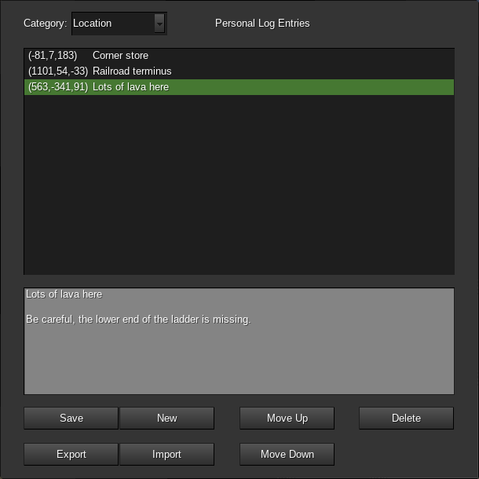

# Personal Logs

This mod adds a "Personal Logs" feature to the Unified Inventory or the SFInv Minetest interfaces. There's also an option (disabled by default) to add a craftable item players can use to access the log screen, if that's preferred or if this mod is being used with an unsupported inventory interface.

Personal logs are private notes that players can keep for themselves. There's also the ability to export or import them to and from the default mod's "book" items, allowing players to share their notes with others if they want.

Logs can be entered into three different categories:

- Locations
- Events
- General

Location logs will automatically have the player's coordinates saved with them when they're created. If the [ccompass](https://github.com/minetest-mods/ccompass) mod is installed there will be an interface that allows players to set a compass to track the location of one of these entries. Players can also read and write maps belonging to the [compassgps](https://github.com/Kilarin/compassgps/) mod. If a player has the teleport privilege they will also be presented with a "teleport" button for locations they've logged.

Event logs automatically have the current date saved with them when they're created. They're intended to allow a player to keep a diary of sorts, tracking the story of their game over time.

General logs have a free-form text field for their topic, players can use these to record any other sort of general information they desire.

There's no limit to how many logs a player can write.

# Chat command access

Chat command access is disabled by default. If ``personal_log_chat_command`` is set to ``true`` then the ``/log`` chat command can be used to open the personal log.

If you want to enable this for administrators but require players to craft an item, setting ``personal_log_chat_command_priviledge`` to ``true`` will create the ``personal_log`` privilege to control use of that chat command. Admins will have this privilege it by default.

# API

Other mods can automatically add log entries to players' personal logs using the following functions:

``personal_log.add_location_entry(player_name, content, pos)`` -- Content is a string. If pos is not provided it defaults to the player's position.

``personal_log.add_event_entry(player_name, content, event_date)`` -- Content is a string. Date should be in the format "%Y-%m-%d", if it is not provided it will default to the current date.
			
``personal_log.add_general_entry(player_name, content, general_topic)`` -- Both content and general_topic are strings.